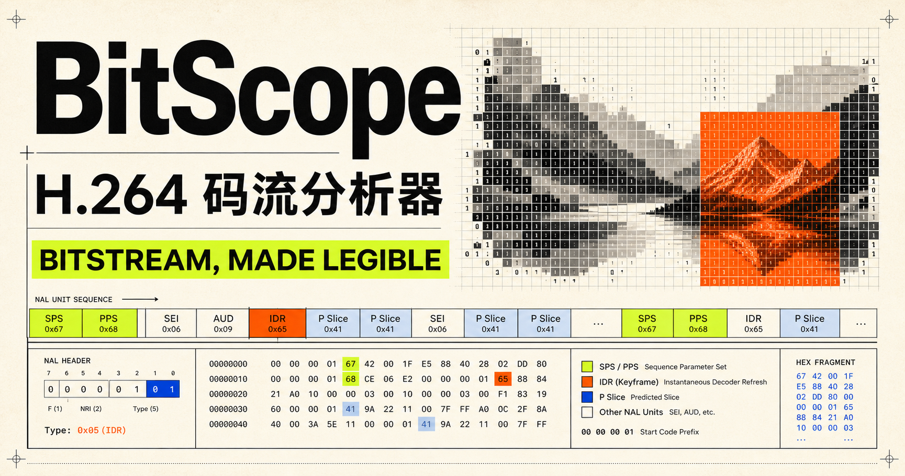

<p align="center">
  
</p>

<h1 align="center">BitScope</h1>

<p align="center">
  <strong>让压缩视频码流清晰可见。</strong><br>
  在浏览器中查看 AVC、HEVC、VVC 和 AV1 的结构与解码画面。
</p>

<p align="center">
  <a href="README.md">English</a> · 简体中文
</p>

<p align="center">
  
  
  
  
</p>

## BitScope 是什么？

BitScope 是一款可视化 H.264/AVC、H.265/HEVC、H.266/VVC 和 AV1 裸码流分析工具，适合视频开发者、编解码工程师、学生，以及所有希望了解压缩视频内部结构的人。

导入 Annex-B NAL 码流或低开销格式 AV1 OBU 后，BitScope 会完全在本地解析码流，展示媒体信息和编码单元布局；浏览器通过 WebCodecs 支持相应编码时，还可同步显示解码画面，并让当前帧与语法信息保持联动。文件不会上传，也不依赖服务端分析。

## 功能亮点

| | 功能 | 可查看的信息 |
|---|---|---|
| **01** | 码流概览 | Profile、Level、编码/显示尺寸、帧率、色度格式和位深 |
| **02** | NAL / OBU 时间线 | 编码相关类型、层级、Temporal ID、字节偏移、负载和头部大小 |
| **03** | 解码画面 | 逐帧显示，并与当前访问单元保持同步 |
| **04** | 编码块视图 | 随编码格式切换宏块、CTU 或 Superblock 网格，支持点击选择和坐标查看 |
| **05** | H.264 子块 | 显示 CAVLC 宏块类型，以及 16×16、16×8、8×16、8×8、8×4、4×8、4×4 真实分区 |
| **06** | 语法详情 | 序列参数和单元头字段，以及大小受控的十六进制数据视图 |
| **07** | 本地隐私 | 所有分析均在浏览器内完成，原始码流不会上传 |

## 输入格式

| 格式 | 状态 | 说明 |
|---|:---:|---|
| H.264 Annex-B 裸码流（`.h264`、`.264`、`.avc`） | ✅ | 支持 3 字节和 4 字节起始码 |
| H.265 Annex-B 裸码流（`.h265`、`.265`、`.hevc`） | ✅ | VPS/SPS/PPS、VCL 单元、层级和 CTU 大小 |
| H.266 Annex-B 裸码流（`.h266`、`.266`、`.vvc`） | ✅ | 支持结构分析；浏览器暂不能解码 |
| 低开销 AV1 OBU（`.av1`、`.obu`） | ✅ | 带长度 OBU、Sequence Header、帧、Tile 和元数据 |
| AV1 IVF（`.ivf`） | ✅ | DKIF 文件头、尺寸、时间基、帧记录及内部 OBU |
| MP4 / MOV | — | 需要先提取对应的裸码流 |
| MKV / WebM | — | 暂未实现容器解复用 |
| MPEG-TS | — | 暂未实现容器解复用 |
| 长度前缀 AVC/HEVC/VVC | — | 当前要求 Annex-B 输入 |

当前单个文件上限为 **200 MB**。NAL/OBU 单元解析数量最多为 **100,000 个**，以避免异常或超大码流导致页面失去响应。

## 分析范围

| 编码格式 | 当前支持内容 |
|---|---|
| H.264 / AVC | SPS Profile、Level、尺寸、帧率、色度/位深；NAL 和 Slice 摘要；CAVLC I/P 宏块类型、CBP、ΔQP 和真实分区 |
| H.265 / HEVC | VPS/SPS/PPS、Profile、Level、尺寸、色度/位深、层级/Temporal ID、IRAP 帧，以及 SPS 声明的 CTU 大小 |
| H.266 / VVC | NAL 类型、VPS/SPS/PPS/APS/PH/SEI、层级/Temporal ID、随机访问单元和声明的 CTU 大小 |
| AV1 | OBU 分帧、Sequence Header 的 Profile/Level/尺寸/色度/位深、帧类型、Tile/元数据，以及 64/128 Superblock |
| 画面 | 浏览器具备对应能力时通过 WebCodecs 解码 AVC、HEVC 或 AV1；VVC 仅进行结构分析 |

> [!NOTE]
> H.264 CAVLC I/P 分区来自真实语法解析；不支持的 H.264 模式及其他编码仍仅显示结构网格。当 VVC 码流缺少 Picture Header/AUD 时，帧数可能是近似值。

## 快速开始

### 从源码运行

环境要求：**Node.js 22.13 或更高版本**、npm。

```bash
git clone git@github.com:konnerzhu/bitstream_analyzer.git
cd bitstream_analyzer
npm install
npm run dev
```

打开 [http://localhost:3000](http://localhost:3000)，将受支持的裸码流拖入页面，或从磁盘选择文件。

> [!IMPORTANT]
> 以上是开发环境命令。无需安装 Node.js 的独立桌面 GUI 安装包已经列入计划，但目前尚未发布。

## 使用方法

1. 导入 AVC/HEVC/VVC Annex-B 码流、AV1 OBU 码流或 AV1 IVF 文件。
2. 在时间线或列表中选择帧、NAL 或 OBU 单元。
3. 查看同步的解码画面与语法面板。
4. 开启编码块覆盖层，点击块即可查看地址、坐标、边界及可用的 Slice 归属。
5. 在画面上滚动鼠标滚轮，可在 **50%～800%** 范围内缩放；点击 **Fit** 可恢复为适应窗口大小。

如果浏览器不支持 WebCodecs 或没有对应的解码器，码流解析功能仍然可用，但无法显示解码画面。H.266/VVC 目前没有 WebCodecs 解码路径。

## 项目结构

| 路径 | 用途 |
|---|---|
| `app/Analyzer.tsx` | 分析器 UI、帧解码、导航、缩放和编码块交互 |
| `app/codecs.ts` | 编码格式检测及 HEVC、VVC、AV1 结构解析 |
| `app/h264.ts` | Annex-B 扫描、位读取、防竞争字节移除和 H.264 语法解析 |
| `app/h264-subblocks.ts` | 带边界保护的 H.264 SPS/PPS/Slice 与 CAVLC 宏块/子分区解析 |
| `app/analyzer.css` | 响应式分析界面与视觉样式 |
| `public/` | 项目与应用图片资源 |

## 开发命令

```bash
npm run dev      # 启动本地开发服务器
npm run build    # 生成生产构建
npm run lint     # 执行静态检查
```

项目使用 TypeScript、React 19 和 vinext 开发。解析和解码逻辑有意保留在客户端，以便未来复用到桌面应用中。

## 已知限制

- 当前支持 Annex-B NAL 裸码流、低开销 AV1 OBU 和 AV1 IVF；尚不包含通用容器解复用。
- 解码结果取决于浏览器、操作系统以及可用的 AVC/HEVC/AV1 编解码实现；VVC 仅支持分析。
- H.264 子块当前支持逐行 8-bit 4:2:0 CAVLC I/P Slice；CABAC、B Slice、FMO、隔行/MBAFF、运动矢量数值与残差系数数值会明确显示为不支持，不会通过推测填充。
- HEVC、VVC 和 AV1 目前仍只显示顶层编码单元网格，尚未熵解码子分区。
- 隔行码流和部分少见的参数集组合，可能包含已解析但尚未可视化的字段。

## 路线图

- [ ] 发布适用于 macOS、Windows 和 Linux 的桌面 GUI 安装包
- [x] 解析 H.264 CAVLC I/P 宏块类型和真实分区
- [ ] 支持 H.264 CABAC/B Slice、运动矢量、参考帧和残差系数详情
- [ ] 支持 MP4/MKV/MPEG-TS 解复用和 AVCC 转换
- [ ] 导出码流分析报告及帧/宏块数据
- [ ] 深入解析 HEVC、VVC 和 AV1 的 Picture/Slice 语法

## 参与贡献

欢迎提交问题、测试码流、解析修正和 UI 改进。请勿提交受版权保护或包含敏感信息的视频样本；仅分享你有权提供、且足以复现问题的最小码流。

提交 Pull Request 前请运行：

```bash
npm run lint
npm run build
```


---

<p align="center">
  为每一个想知道“这些字节究竟在做什么”的人而构建。
</p>
